<div align="center">

# JATRA APP BD

### Smart Multi-Transport Ticket Booking & Management System

**One platform for Bus, Train, Air and Launch booking — built around the Bangladesh travel context.**

[](https://www.python.org/)
[](https://flask.palletsprojects.com/)
[](https://www.sqlite.org/)
[](https://getbootstrap.com/)
[](https://www.pythonanywhere.com/)


**[Live Demo](https://jatra26.pythonanywhere.com)** · **[Feature Walkthrough](#complete-feature-walkthrough)** · **[Quick Start](#quick-start)** · **[Deployment Journey](#deployment-journey)**

</div>

---

## Table of Contents

- [Project Overview](#project-overview)
- [Project Status](#project-status)
- [Problem Statement](#problem-statement)
- [Solution](#solution)
- [Core Capabilities](#core-capabilities)
- [Complete Feature Walkthrough](#complete-feature-walkthrough)
  - [User Experience](#1-user-experience)
  - [Operator Portal](#2-operator-portal)
  - [Admin Portal](#3-admin-portal)
- [System Workflow](#system-workflow)
- [System Architecture](#system-architecture)
- [Database Design](#database-design)
- [Technology Stack](#technology-stack)
- [Project Structure](#project-structure)
- [Quick Start](#quick-start)
- [PDF Engine Setup](#pdf-engine-setup)
- [Deployment Journey](#deployment-journey)
- [Deployment Challenges and Solutions](#deployment-challenges-and-solutions)
- [Live Demo Availability](#live-demo-availability)
- [Security and Repository Hygiene](#security-and-repository-hygiene)
- [Testing Matrix](#testing-matrix)
- [Known Limitations](#known-limitations)
- [Future Improvements](#future-improvements)
- [Team and Equal Contribution](#team-and-equal-contribution)
- [Academic Project Note](#academic-project-note)
- [License](#license)

---

## Project Overview

**JATRA APP BD** is a server-rendered Flask web application designed as a unified multi-transport ticket booking and management platform for the Bangladesh travel context.

The system brings **Bus, Train, Air and Launch** journeys into a single workflow and supports three separate operational roles:

| Role | Primary Responsibility |
|---|---|
| **User / Passenger** | Search and compare trips, select seats, apply Jatra Coins, reserve or fully pay, receive QR e-tickets/PDF invoices, manage tickets and submit reviews |
| **Operator** | Manage company routes, walk-in/POS bookings, fares, expenses, dues, live trip status and financial performance |
| **Admin** | Monitor system analytics, manage trips, review all bookings, manage operators and moderate passenger reviews |

The application was developed locally in **PyCharm on Windows** and later adapted for a **Linux-based PythonAnywhere deployment**, including database-path portability, QR URL portability and cross-platform PDF generation.

---

## Project Status

| Area | Status |
|---|---|
| User authentication | ✅ Functional |
| Multi-transport search and comparison | ✅ Functional |
| Seat selection and booking | ✅ Functional |
| Full / partial payment workflow | ✅ Functional |
| Jatra Coins reward and discount logic | ✅ Functional |
| QR e-ticket verification | ✅ Functional |
| PDF invoice generation | ✅ Functional |
| Cancellation and refund rules | ✅ Functional |
| Reviews and bonus coins | ✅ Functional |
| Operator portal | ✅ Functional |
| Admin portal | ✅ Functional |
| Local Windows execution | ✅ Tested |
| PythonAnywhere deployment | ✅ Live |
| Real payment processor | ⚠️ Simulated checkout flow |
| Real email delivery | ⚠️ Not yet integrated |

> **Project maturity:** Academic/portfolio deployment. The current system demonstrates the end-to-end product workflow, role separation, business logic and deployment process; it is not presented as a production payment platform.

---

## Problem Statement

Travel booking is often fragmented by transport type, operator and service channel. A passenger may need different websites or counters for bus, train, air and launch tickets, while operators need their own tools for seat sales, dues, expenses and route updates.

The project explores how one application can provide:

- a unified transport search experience;
- route-aware transport availability;
- transparent fare comparison;
- seat-level booking visibility;
- reservation and payment-state tracking;
- digital ticket verification;
- operator-side operational tools;
- central administrative monitoring.

---

## Solution

JATRA APP BD combines the passenger, operator and administrator workflows in one Flask application.

The passenger side focuses on **discovery → comparison → booking → ticket management**. The operator side focuses on **sales → route operations → financial tracking**. The admin side provides **central visibility and control**.

The system uses:

- server-side Flask routes for application logic;
- Jinja2 templates and Bootstrap-based UI rendering;
- SQLite for users, trips, tickets, operators, administrators and reviews;
- Werkzeug password hashing for authentication;
- QR generation for ticket verification;
- `pdfkit` + `wkhtmltopdf` for downloadable ticket/invoice PDFs;
- PythonAnywhere WSGI hosting for the live deployment.

---

## Core Capabilities

| Capability | How it works |
|---|---|
| **Multi-transport search** | Users can search Bus, Train, Air or Launch individually, or use **Compare All** |
| **Route validation** | The backend limits transport types according to configured Bangladesh route/city rules |
| **Smart route insights** | Search results identify the cheapest option, fastest route and a best-value recommendation |
| **Dynamic demand pricing** | Trips with low remaining seat availability receive a demand-based fare adjustment |
| **Seat awareness** | Previously booked seat identifiers are read from ticket data and reflected in the checkout layout |
| **Class pricing** | Economy, Standard, Premium and VIP/Business selections affect fare calculations |
| **Jatra Coins** | Users start with reward coins, can spend them as discounts, earn coins from payment and earn bonus coins from reviews |
| **Partial payment** | A booking can be reserved by paying 50%, leaving an outstanding due for later collection |
| **QR verification** | Generated QR codes point to a public e-ticket verification route using the active host/domain |
| **PDF invoice** | Invoice HTML is rendered to PDF using `pdfkit` and the `wkhtmltopdf` executable |
| **Refund logic** | Cancellation refund percentage is calculated from the time remaining before departure |
| **Operator finance** | Operator revenue, expenses, dues and net profit are calculated from ticket/operator data |
| **Admin control** | Admins can monitor bookings, trips, operators, reviews and system-level summary metrics |

---

# Complete Feature Walkthrough

> Screenshots are stored under `docs/screenshots/`. Test/demo records should be used for public documentation; personal phone numbers, credentials or sensitive live ticket data should not be published.

## 1. User Experience

### 1.1 User Login

<p align="center">
  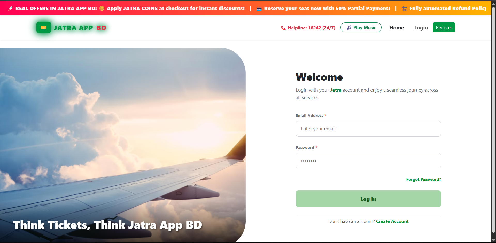
</p>

**Purpose:** Provides the passenger authentication entry point.

**Technical behavior:** The Flask login route retrieves the user by email from SQLite and validates the submitted password using Werkzeug's password-hash checking. On success, the application stores the user ID, name and coin balance in the Flask session.

---

### 1.2 User Registration

<p align="center">
  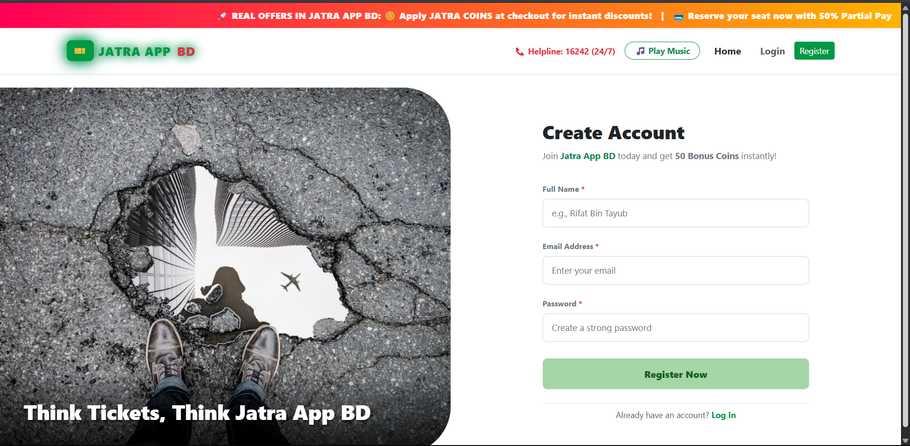
</p>

**Purpose:** Allows a new passenger to create an account.

**Technical behavior:** Passwords are hashed before storage. Email uniqueness is enforced by the database, and new users begin with the configured Jatra Coins balance.

---

### 1.3 Main Booking Dashboard

<p align="center">
  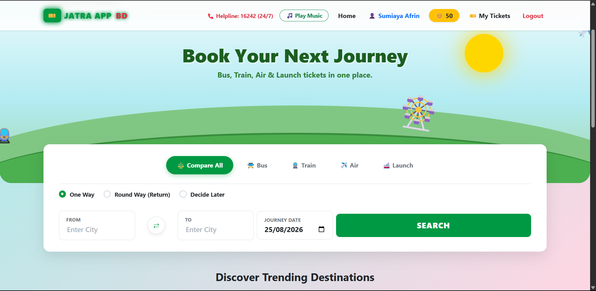
</p>

The main passenger dashboard is the central booking entry point. It exposes:

- Compare All, Bus, Train, Air and Launch modes;
- One Way, Round Way and Decide Later trip options;
- departure and destination fields;
- journey date selection;
- current Jatra Coins;
- My Tickets access.

This screen expresses the main product idea: **multiple transport modes through one passenger interface**.

---

### 1.4 Trip Search Input

<p align="center">
  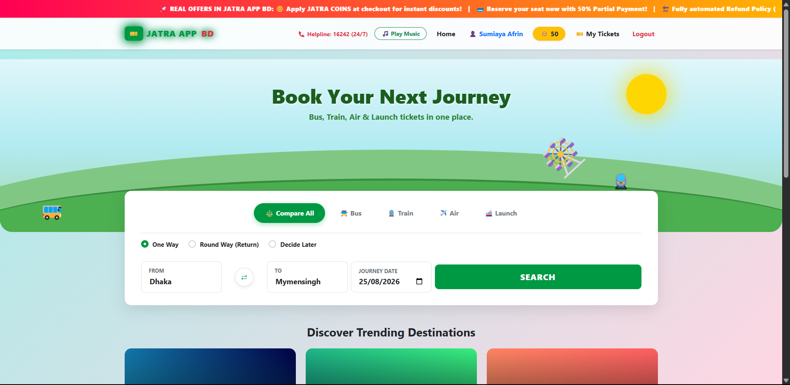
</p>

The passenger selects a route, travel date and transport mode. Before querying trips, backend rules verify that the chosen transport is physically configured as available for the route.

When **Compare All** is selected, the backend queries every valid transport mode for the selected route.

---

### 1.5 Compare All and Smart Fare Insights

<p align="center">
  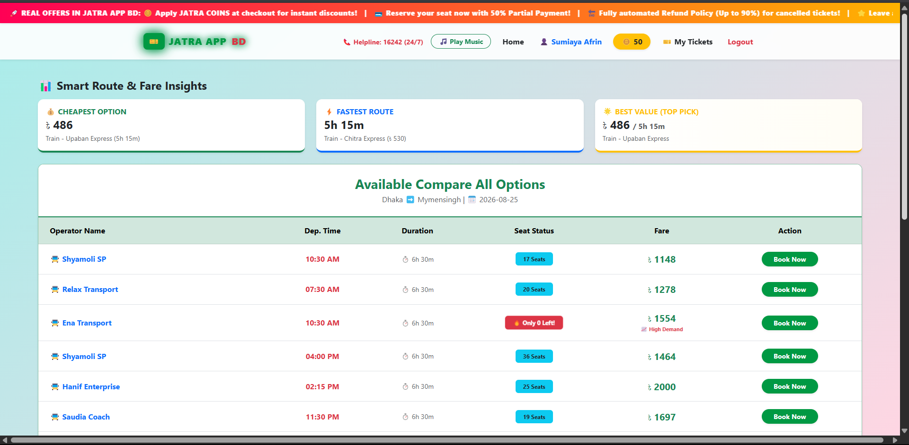
</p>

The results page turns raw trip records into a decision-oriented comparison.

It highlights:

- **Cheapest Option** — minimum final fare;
- **Fastest Route** — minimum trip duration;
- **Best Value** — recommendation derived from fare and duration;
- operator name;
- departure time;
- remaining seats;
- final fare;
- low-seat warnings;
- demand/surge indicators.

**Backend detail:** when remaining seats are at or below the configured low-seat threshold used in the application logic, the displayed fare can receive a demand adjustment.

---

### 1.6 Seat Selection and Checkout

<p align="center">
  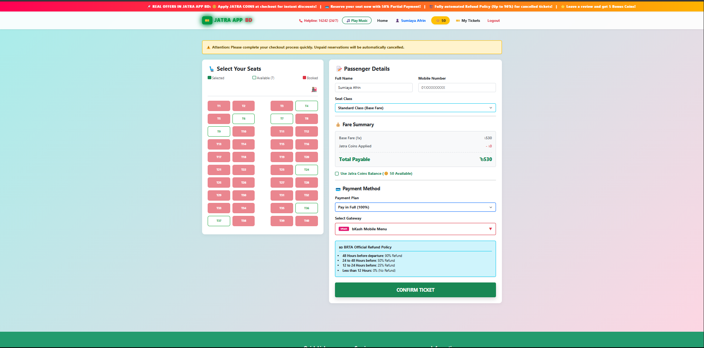
</p>

The checkout combines seat state, passenger details and payment configuration.

Key capabilities include:

- dynamic seat availability display;
- booked vs available seat state;
- class selection;
- fare summary;
- Jatra Coins toggle;
- payment-plan selection;
- payment-method selection;
- displayed refund policy.

The backend reconstructs booked seat identifiers from existing non-cancelled ticket records so that previously occupied seats can be represented in the UI.

---

### 1.7 Jatra Coins + Partial Payment

<p align="center">
  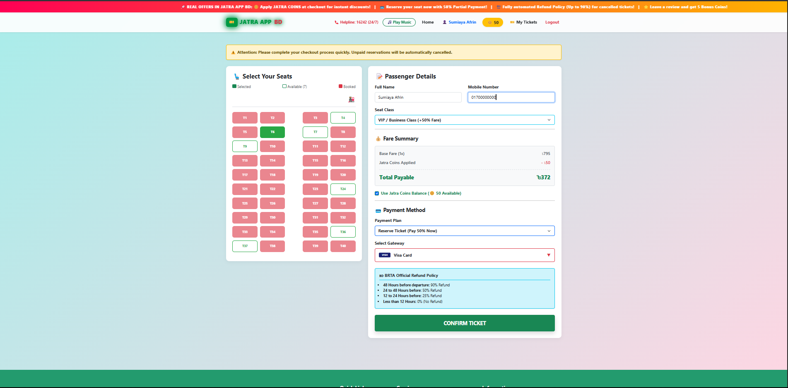
</p>

Jatra Coins operate as a simple loyalty/reward mechanism.

The booking calculation can:

1. apply a seat-class multiplier;
2. calculate the booking subtotal;
3. deduct eligible Jatra Coins;
4. choose full payment or a **50% reservation payment**;
5. calculate the remaining due;
6. award new coins based on the amount actually paid.

This allows the project to demonstrate both **reward accounting** and **payment-state accounting** inside the same booking transaction.

---

### 1.8 Simulated Payment Gateway

<table>
<tr>
<td width="50%" valign="top">

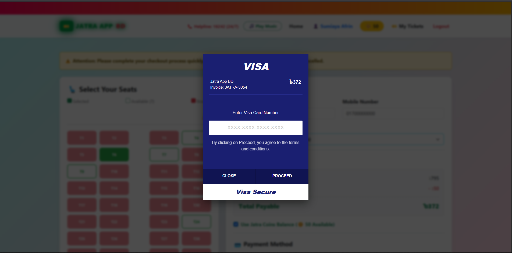

**Gateway UI**

The checkout provides a branded gateway-style modal for payment method selection and payment confirmation.

</td>
<td width="50%" valign="top">

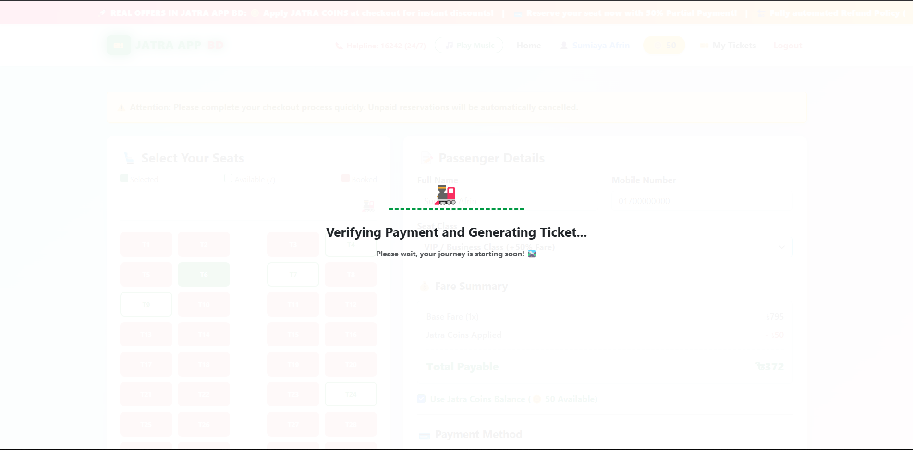

**Verification State**

A payment-verification/loading state communicates the transition from checkout to ticket generation.

</td>
</tr>
</table>

> **Important:** This is a **payment workflow simulation**, not a real card/mobile-financial-service transaction integration. No real payment provider is claimed.

---

### 1.9 Reservation Voucher and QR E-Ticket

<p align="center">
  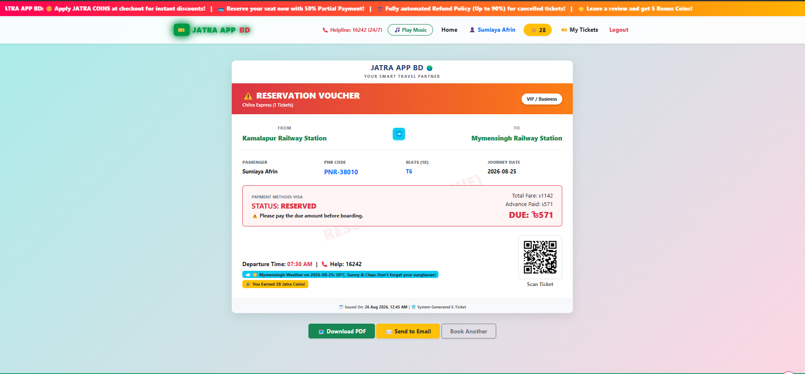
</p>

After booking, the system generates a ticket containing:

- PNR;
- passenger;
- route and station names;
- journey date and departure time;
- seat/class information;
- payment state;
- amount paid and due;
- Jatra Coins earned;
- QR code;
- system-generated issue time.

**QR implementation:** the QR target is generated with Flask's external URL generation so the same code can create a local URL during development and the public PythonAnywhere URL in deployment.

---

### 1.10 Professional PDF Invoice

<p align="center">
  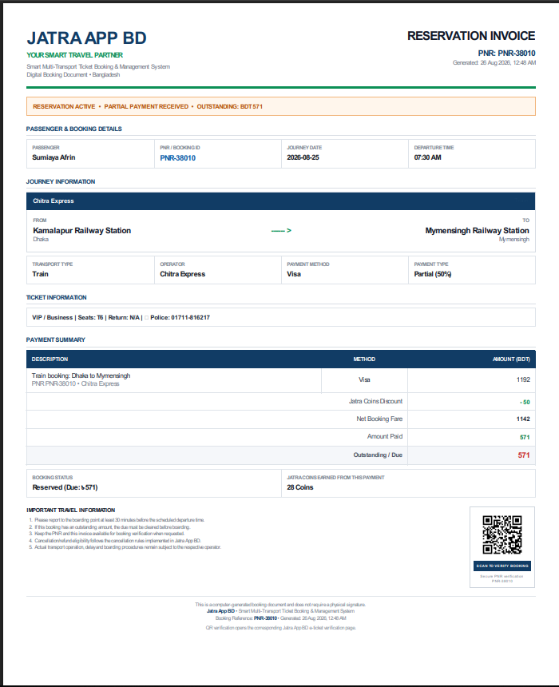
</p>

The application renders a dedicated invoice template and converts it to PDF.

The invoice includes:

- booking identity;
- journey details;
- fare/payment breakdown;
- Jatra Coins discount;
- amount paid;
- outstanding due;
- booking status;
- QR verification;
- travel information.

**PDF pipeline:**

`Jinja invoice template → rendered HTML → pdfkit → wkhtmltopdf → downloadable PDF response`

---

### 1.11 My Tickets and Live Trip Status

<p align="center">
  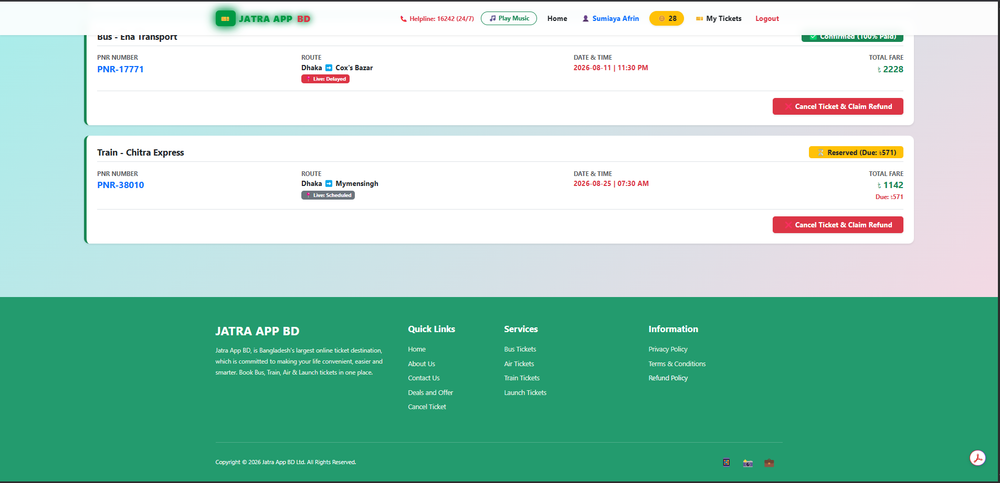
</p>

The My Tickets page provides a passenger-focused history view containing:

- booking PNR;
- route;
- operator/transport;
- journey date/time;
- fare;
- paid/reserved/cancelled state;
- outstanding due;
- operator-published live trip status;
- cancellation action where eligible.

---

### 1.12 Time-Based Cancellation Policy

<p align="center">
  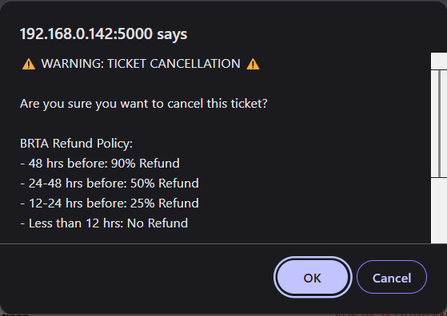
</p>

The project implements a time-sensitive refund model:

| Time before departure | Refund |
|---|---:|
| 48 hours or more | 90% |
| 24–48 hours | 50% |
| 12–24 hours | 25% |
| Less than 12 hours | 0% |

The refundable base is calculated from the amount actually paid rather than an unpaid outstanding amount.

---

### 1.13 Cancellation Result and Coin Reversal

<p align="center">
  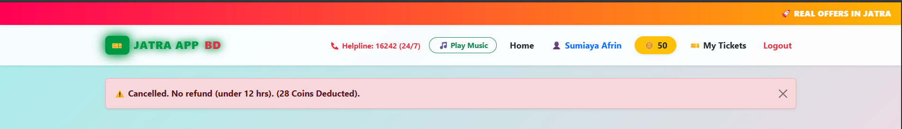
</p>

Cancellation updates the ticket status and applies the appropriate refund outcome.

The reward system is also reconciled:

- coins earned from the cancelled booking are reversed;
- coins previously spent on the booking are restored according to the implemented logic;
- booked seat capacity is returned to the trip.

This demonstrates that cancellation affects **ticket state, financial state, loyalty state and seat inventory**, not only a status label.

---

### 1.14 Review Reward Result

<p align="center">
  
</p>

Passenger feedback appears in the public review area. Submitted ratings include the transport type, rating and comment.

The system also rewards a successful post-journey review with **5 Jatra Coins**.

---

### 1.15 Pending Review Form

<p align="center">
  
</p>

The dashboard can identify that a user has completed journeys but has not submitted the corresponding number of reviews. In that case, a pending-review interface is displayed.

The user can select transport type, rating and feedback before submission.

---

## 2. Operator Portal

### 2.1 Role-Based Operator Login

<p align="center">
  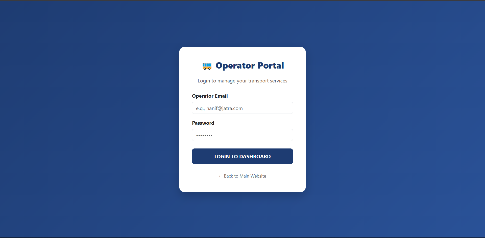
</p>

Operators authenticate separately from passengers. Successful login stores the operator ID and company name in the session, ensuring that subsequent operator queries are scoped to that company.

---

### 2.2 Operator Operations Dashboard

<p align="center">
  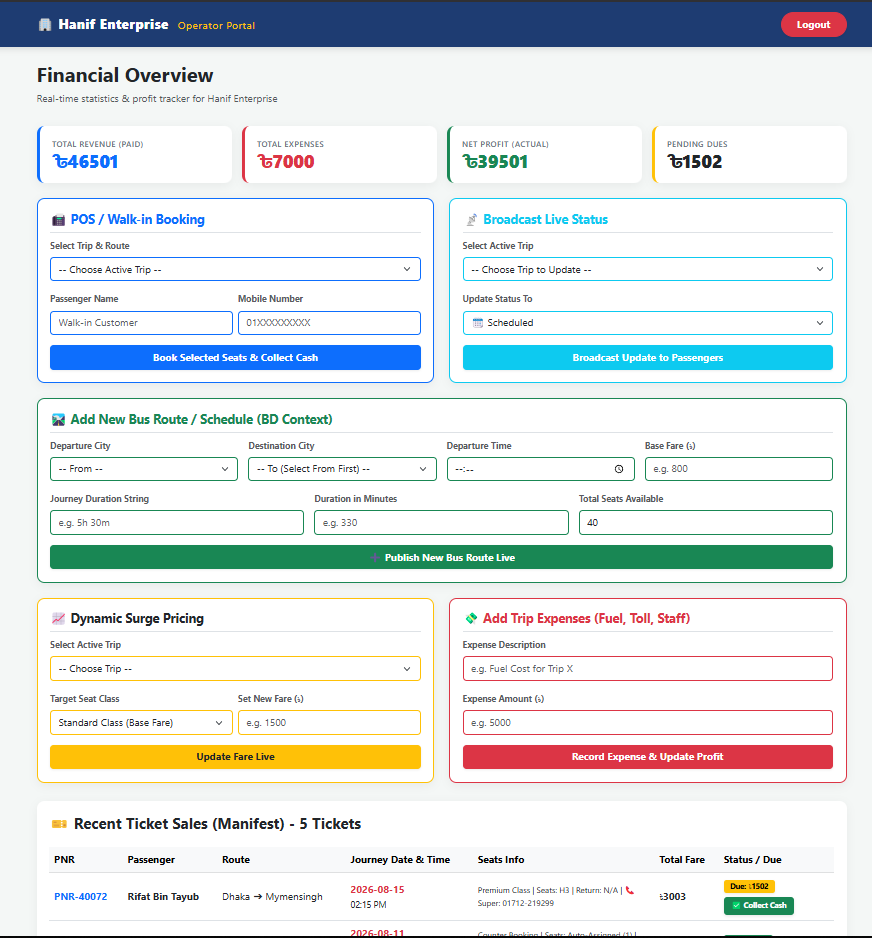
</p>

The operator dashboard combines business and operational functions on one screen:

- revenue, expenses, net profit and dues;
- POS/walk-in booking;
- live status broadcasting;
- route publishing;
- fare updates;
- expense recording;
- ticket manifest.

Operator ticket and trip queries are filtered by the authenticated operator/company.

---

### 2.3 POS / Walk-In Booking

<p align="center">
  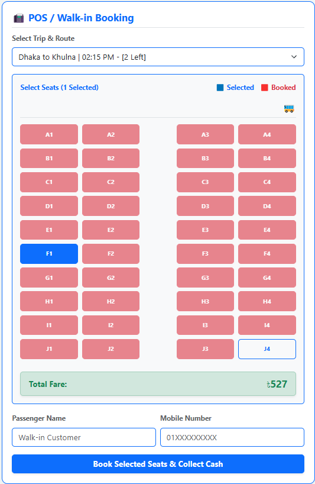
</p>

Operators can sell tickets directly at a counter.

The workflow provides:

- active trip selection;
- current remaining-seat context;
- booked/available seat visualization;
- seat selection;
- automatic fare calculation;
- walk-in passenger details;
- cash booking.

The resulting ticket is inserted into the same ticket system used by online passenger bookings, maintaining one shared manifest.

---

### 2.4 Route and Schedule Management

<p align="center">
  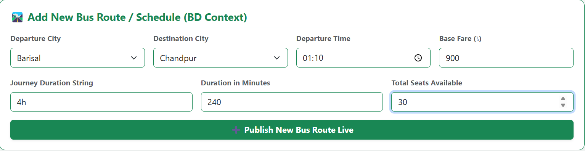
</p>

Operators can add new routes with:

- departure;
- destination;
- departure time;
- base fare;
- human-readable duration;
- duration in minutes;
- seat capacity.

The route is stored in the trips database and becomes available to the system's trip workflows.

---

### 2.5 Dynamic Fare Update

<p align="center">
  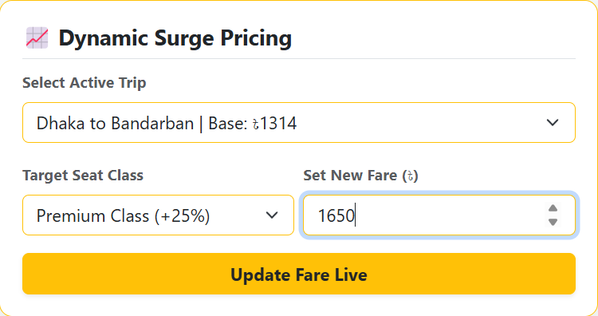
</p>

An operator can select an owned trip, choose a seat class and update the fare.

The backend normalizes class-specific input back to the trip's base fare according to the class multiplier so that the passenger-side pricing model remains consistent.

---

### 2.6 Expense Tracking

<p align="center">
  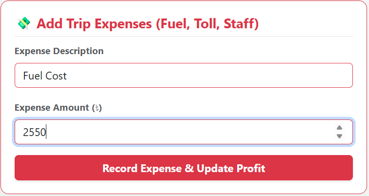
</p>

Operational expenses such as fuel, toll and staff costs can be recorded against the operator account.

The dashboard calculates:

`Net Profit = Paid Revenue − Total Expenses`

This provides a simple operational finance view rather than only a ticket-sales count.

---

### 2.7 Live Trip Status Broadcasting

<p align="center">
  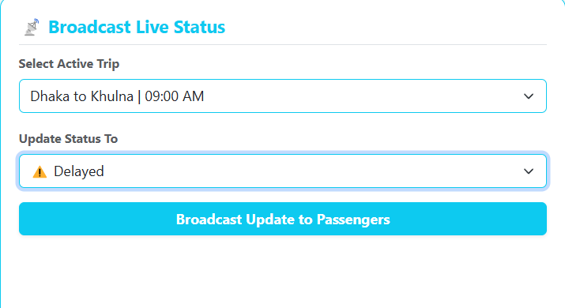
</p>

Operators can publish a live state such as **Scheduled** or **Delayed** for their trip.

The passenger's My Tickets view reads the matching trip state, allowing an operator-side update to become visible on the passenger side.

---

### 2.8 Ticket Manifest and Due Collection

<p align="center">
  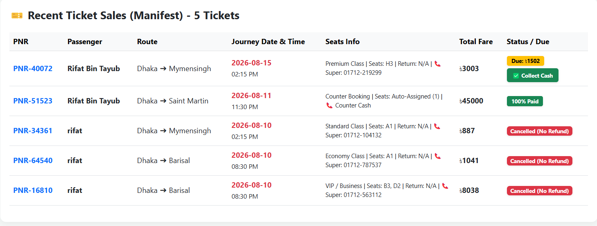
</p>

The operator manifest displays booking-level information including:

- PNR;
- passenger;
- route;
- date and time;
- seat/class data;
- total fare;
- payment state.

For partially paid reservations, the operator can collect the outstanding amount and convert the booking to a fully paid state.

---

### 2.9 Real-Time Financial Overview

<p align="center">
  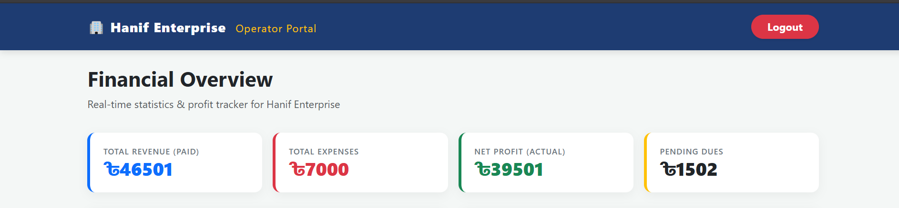
</p>

The financial summary calculates:

- total paid revenue;
- total expenses;
- actual net profit;
- pending dues.

This gives each operator a company-specific snapshot derived from the shared booking database.

---

## 3. Admin Portal

### 3.1 Role-Based Admin Login

<p align="center">
  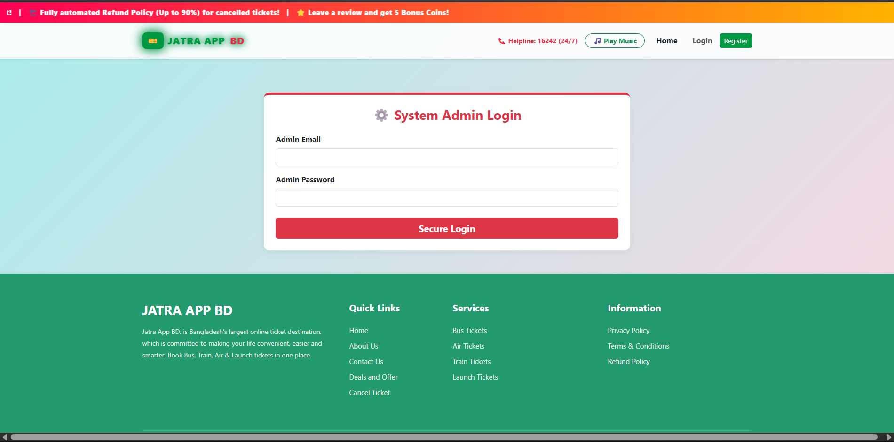
</p>

Administrative access is isolated from the standard passenger interface. Admin authentication is validated against the administrator table using hashed password checking.

---

### 3.2 Admin Analytics Dashboard

<p align="center">
  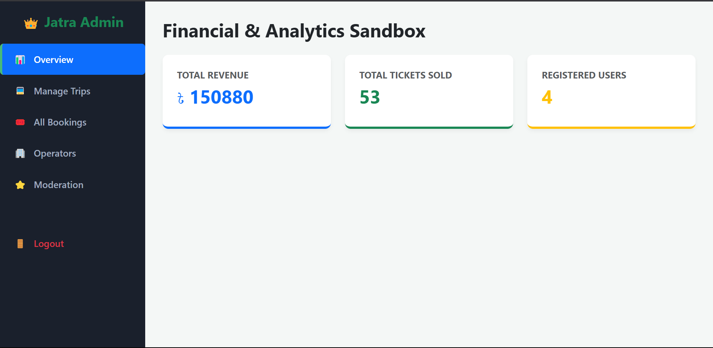
</p>

The admin overview summarizes:

- paid system revenue;
- total tickets;
- registered users.

The sidebar provides navigation to trip control, booking authority, operator management and review moderation.

---

### 3.3 Dynamic Trip and Route Control

<p align="center">
  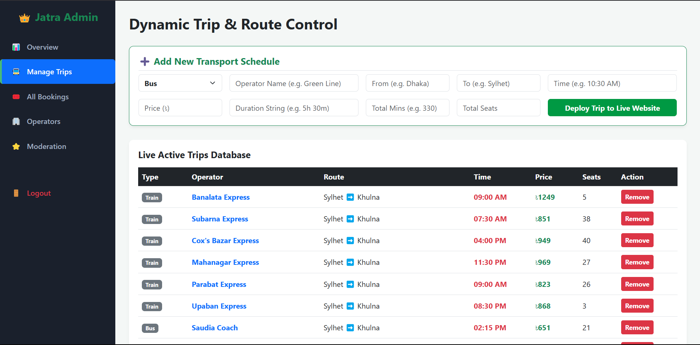
</p>

The admin can:

- create transport schedules;
- specify operator, route, time, price, duration and seat capacity;
- deploy a new trip to the application's live trip database;
- review active trips;
- remove trips.

This is the system-level trip control layer above individual operator workflows.

---

### 3.4 Centralized Booking Authority

<p align="center">
  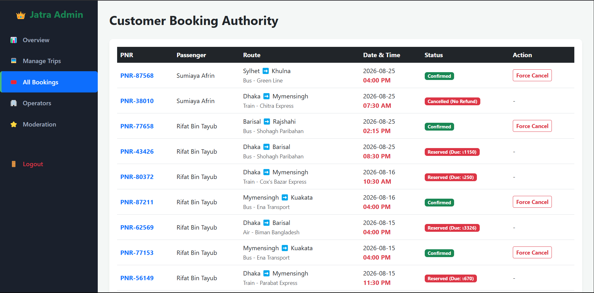
</p>

The admin booking view centralizes bookings from all operators and passengers.

It shows:

- PNR;
- passenger;
- route/operator;
- date/time;
- confirmed, reserved or cancelled state;
- outstanding due;
- administrative force-cancel action for eligible confirmed tickets.

---

### 3.5 Operator Management

<p align="center">
  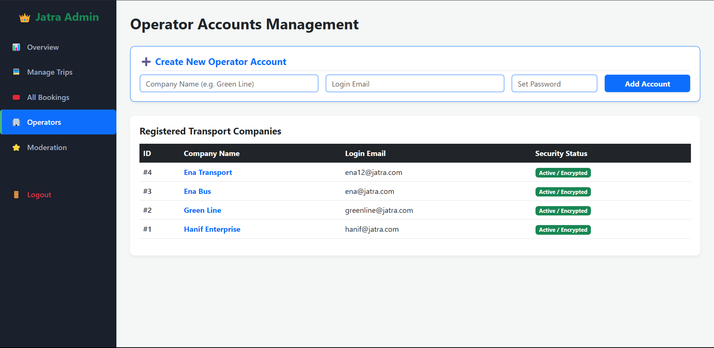
</p>

The admin can review operator accounts and create additional operator credentials. Operator passwords are hashed before they are stored.

---

### 3.6 Review Moderation

<p align="center">
  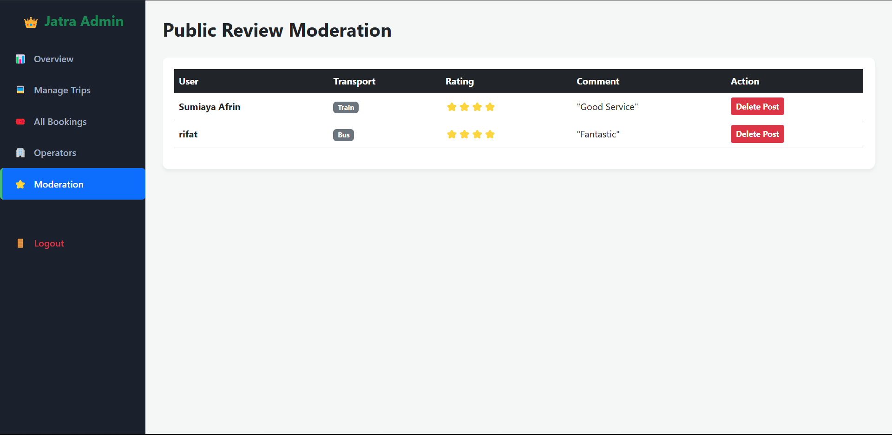
</p>

Passenger feedback can be reviewed centrally. The admin moderation workflow can remove inappropriate or invalid review records from the public review area.

---

# System Workflow

## Passenger Flow

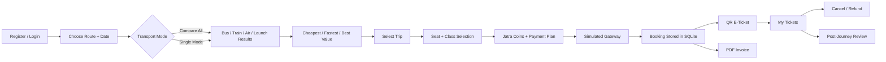
```mermaid
flowchart LR
    A[Register / Login] --> B[Choose Route + Date]
    B --> C{Transport Mode}
    C -->|Compare All| D[Bus / Train / Air / Launch Results]
    C -->|Single Mode| D
    D --> E[Cheapest / Fastest / Best Value]
    E --> F[Select Trip]
    F --> G[Seat + Class Selection]
    G --> H[Jatra Coins + Payment Plan]
    H --> I[Simulated Gateway]
    I --> J[Booking Stored in SQLite]
    J --> K[QR E-Ticket]
    J --> L[PDF Invoice]
    K --> M[My Tickets]
    M --> N[Cancel / Refund]
    M --> O[Post-Journey Review]
```

## Operator Flow

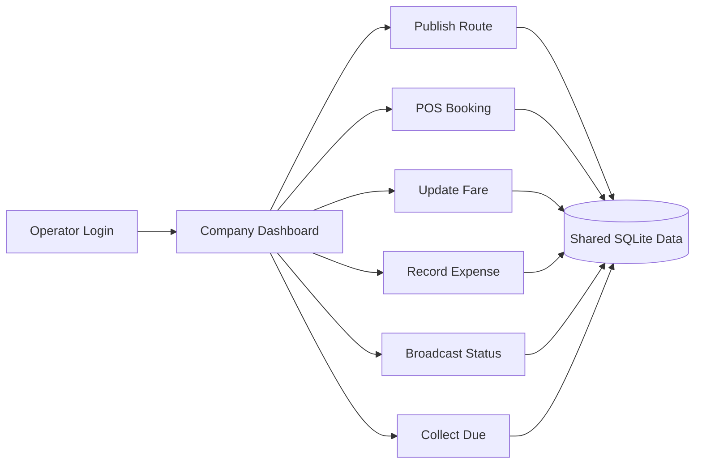
```mermaid
flowchart LR
    A[Operator Login] --> B[Company Dashboard]
    B --> C[Publish Route]
    B --> D[POS Booking]
    B --> E[Update Fare]
    B --> F[Record Expense]
    B --> G[Broadcast Status]
    B --> H[Collect Due]
    C --> I[(Shared SQLite Data)]
    D --> I
    E --> I
    F --> I
    G --> I
    H --> I
```

## Admin Flow

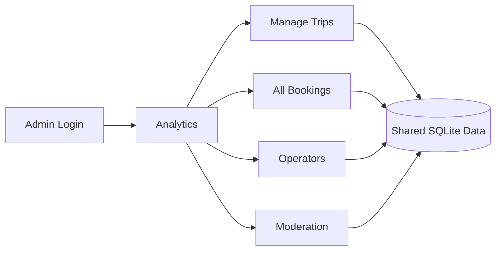
```mermaid
flowchart LR
    A[Admin Login] --> B[Analytics]
    B --> C[Manage Trips]
    B --> D[All Bookings]
    B --> E[Operators]
    B --> F[Moderation]
    C --> G[(Shared SQLite Data)]
    D --> G
    E --> G
    F --> G
```

---

# System Architecture

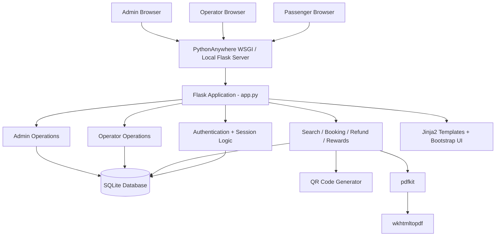
```mermaid
flowchart TB
    U[Passenger Browser]
    O[Operator Browser]
    A[Admin Browser]

    WSGI[PythonAnywhere WSGI / Local Flask Server]
    FLASK[Flask Application - app.py]

    AUTH[Authentication + Session Logic]
    BOOK[Search / Booking / Refund / Rewards]
    OPS[Operator Operations]
    ADM[Admin Operations]

    JINJA[Jinja2 Templates + Bootstrap UI]
    DB[(SQLite Database)]
    QR[QR Code Generator]
    PDF[pdfkit]
    WK[wkhtmltopdf]

    U --> WSGI
    O --> WSGI
    A --> WSGI

    WSGI --> FLASK

    FLASK --> AUTH
    FLASK --> BOOK
    FLASK --> OPS
    FLASK --> ADM

    AUTH --> DB
    BOOK --> DB
    OPS --> DB
    ADM --> DB

    FLASK --> JINJA
    BOOK --> QR
    BOOK --> PDF
    PDF --> WK
```

### Architecture Notes

- The project is a **monolithic Flask application** with route handlers, business logic and database access in `app.py`.
- HTML is rendered server-side through **Jinja2 templates**.
- SQLite is accessed through a small helper that returns rows as dictionary-like `sqlite3.Row` objects.
- QR codes are generated in memory and embedded as Base64 PNG data.
- PDF generation is delegated to the external `wkhtmltopdf` executable through `pdfkit`.
- The same application code supports local Windows execution and Linux deployment through project-relative paths and runtime executable detection.

---

# Database Design

The project uses SQLite with six main domain tables plus SQLite's internal sequence table.

| Table | Purpose | Important Data |
|---|---|---|
| `users` | Passenger accounts | name, email, password hash, coins |
| `tickets` | Booking/reservation records | PNR, passenger, route, date, price, seat info, payment state, due, coins |
| `trips` | Searchable transport schedules | transport, operator, route, time, fare, duration, seats, live status |
| `operators` | Operator accounts and finance | company, email, password hash, total expenses |
| `admins` | Administrative authentication | email, password hash |
| `reviews` | Passenger feedback | user, transport, rating, comment |

### Relationship Model

The current academic implementation uses application-level associations rather than a fully normalized foreign-key schema.

Examples:

- a ticket is linked to an operator by operator/company name;
- passenger ticket history is matched using passenger/user context;
- live status is located by matching operator, route and departure time.

For a production-scale version, these logical relationships should be migrated to explicit foreign keys and immutable IDs.

---

# Technology Stack

| Technology | Role in the Project |
|---|---|
| **Python** | Backend/business logic |
| **Flask** | Routing, request handling, sessions and server-side application structure |
| **Jinja2** | Dynamic HTML template rendering |
| **SQLite** | Persistent user, trip, ticket, operator, admin and review data |
| **Werkzeug Security** | Password hashing and verification |
| **Bootstrap 5.3** | Responsive UI structure and components |
| **HTML / CSS / JavaScript** | Interface, seat interaction, modal/gateway behavior and client-side calculations |
| **Animate.css** | Interface animation support |
| **qrcode** | QR ticket generation |
| **Pillow** | Image support used by the QR stack |
| **pdfkit** | Python interface for HTML-to-PDF conversion |
| **wkhtmltopdf** | Native executable used to render invoice/ticket HTML as PDF |
| **PythonAnywhere** | Public Linux/WSGI hosting environment |
| **PyCharm** | Primary local development environment |

---

# Project Structure

```text
JATRA-APP-BD/
│
├── app.py
├── init_db.py
├── requirements.txt
├── .gitignore
├── README.md
│
├── templates/
│   ├── base.html
│   ├── login.html
│   ├── register.html
│   ├── index.html
│   ├── results.html
│   ├── checkout.html
│   ├── ticket.html
│   ├── e_ticket_view.html
│   ├── invoice_pdf.html
│   ├── my_tickets.html
│   ├── operator_login.html
│   ├── operator_dashboard.html
│   ├── admin_login.html
│   └── admin_dashboard.html
│
├── static/
│   ├── style.css
│   └── audio/
│       └── bg_music.mp3
│
└── docs/
    └── screenshots/
        ├── 01-login.png
        ├── 02-registration.png
        ├── 03-home-dashboard.png
        ├── 04-trip-search.png
        ├── 05-compare-all.png
        ├── 06-seat-selection-checkout.png
        ├── 07-coins-partial-payment.png
        ├── 08-payment-gateway.png
        ├── 09-payment-verification.png
        ├── 10-reservation-e-ticket.png
        ├── 11-professional-pdf-invoice.png
        ├── 12-my-tickets.png
        ├── 13-cancellation-policy.png
        ├── 14-cancellation-refund-result.png
        ├── 15-review-reward-result.png
        ├── 16-review-form.png
        ├── 17-operator-login.png
        ├── 18-operator-dashboard.png
        ├── 19-operator-pos-booking.png
        ├── 20-operator-route-management.png
        ├── 21-operator-fare-update.png
        ├── 22-operator-expense-profit.png
        ├── 23-operator-live-status.png
        ├── 24-operator-due-collection.png
        ├── 25-operator-financial-overview.png
        ├── 26-admin-login.png
        ├── 27-admin-dashboard.png
        ├── 28-admin-manage-trips.png
        ├── 29-admin-bookings.png
        ├── 30-admin-operators.png
        ├── 31-admin-moderation.png
        ├── 32-live-website.png
        └── 33-pythonanywhere-deployment.png
```

> `transport.db`, virtual-environment folders, caches, secrets and local runtime files should be excluded from the public repository.

---

# Quick Start

## 1. Clone the repository

```bash
git clone <YOUR-REPOSITORY-URL>
cd <YOUR-REPOSITORY-FOLDER>
```

## 2. Create a virtual environment

### Windows

```powershell
python -m venv .venv
.venv\Scripts\activate
```

### Linux / macOS

```bash
python3 -m venv .venv
source .venv/bin/activate
```

## 3. Install Python dependencies

```bash
pip install -r requirements.txt
```

The public requirements file should include at minimum:

```text
Flask==3.0.0
qrcode
Pillow
pdfkit
```

## 4. Configure a Flask secret

The application supports the `FLASK_SECRET_KEY` environment variable. For local development it can also generate a private `.secret_key` file that must remain outside Git.

Example:

### Windows PowerShell

```powershell
$env:FLASK_SECRET_KEY="replace-with-a-long-random-secret"
```

### Linux / macOS

```bash
export FLASK_SECRET_KEY="replace-with-a-long-random-secret"
```

## 5. Initialize the database

```bash
python init_db.py
```

> **Warning:** the database initializer is intended for a fresh local/demo database. Do not run a destructive initializer against a live database containing real bookings.

## 6. Start the application

```bash
python app.py
```

Open the local address shown by Flask, typically:

```text
http://127.0.0.1:5000
```

---

# PDF Engine Setup

`pdfkit` requires the **wkhtmltopdf** native executable.

The application resolves the executable in this order:

1. `WKHTMLTOPDF_PATH` environment variable;
2. executable found in the operating system `PATH`;
3. known Windows candidate locations;
4. Linux fallback `/usr/bin/wkhtmltopdf`.

### Optional explicit configuration

Windows PowerShell:

```powershell
$env:WKHTMLTOPDF_PATH="C:\Program Files\wkhtmltopdf\bin\wkhtmltopdf.exe"
```

Linux:

```bash
export WKHTMLTOPDF_PATH="/usr/bin/wkhtmltopdf"
```

This cross-platform resolution was added after the local Windows path failed on the Linux hosting environment.

---

# Deployment Journey

The project was first developed and tested locally in **PyCharm on Windows**, then deployed to **PythonAnywhere**.

<p align="center">
  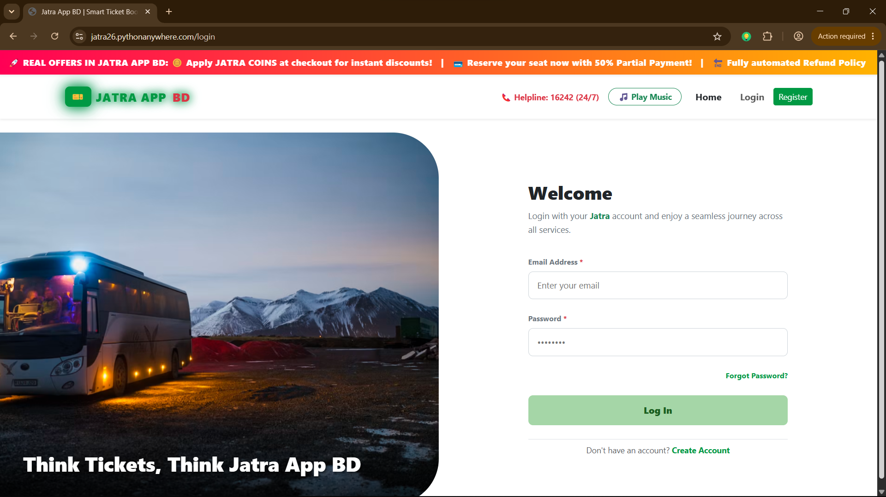
</p>

**Live application:** [https://jatra26.pythonanywhere.com](https://jatra26.pythonanywhere.com)

The live browser screenshot demonstrates that the application is served from the public PythonAnywhere domain rather than only from the local Flask development server.

---

### PythonAnywhere Web Configuration

<p align="center">
  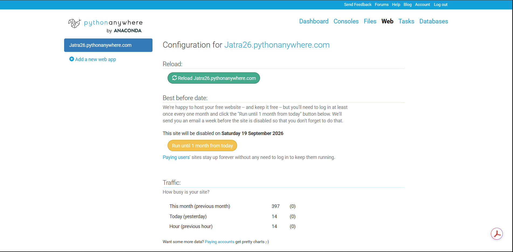
</p>

The deployment uses PythonAnywhere's web-app configuration and WSGI hosting model.

The deployment process required attention to:

- project/import paths;
- SQLite file location;
- Linux executable paths;
- Python dependencies;
- static/templates availability;
- web-app reload after server-side code changes.

---

# Deployment Challenges and Solutions

| Challenge | Root Cause | Resolution | Result |
|---|---|---|---|
| **Login returned HTTP 500** | Flask was opening an SQLite database without the expected `users` table | Inspected server error logs and verified database table lists | Identified a database-location problem rather than an authentication-code problem |
| **`sqlite3.OperationalError: no such table: users`** | `sqlite3.connect('transport.db')` depended on the process working directory | Built the DB path from `os.path.abspath(__file__)` / project base directory | Local and PythonAnywhere code now target the project database consistently |
| **Two `transport.db` files existed on the server** | A relative connection had created/opened another database outside the actual project directory | Searched the account filesystem and verified tables in the intended DB | Prevented the application from silently using the wrong database |
| **PDF worked locally but failed on PythonAnywhere** | The app contained a Windows-only path such as `F:\...\wkhtmltopdf.exe` | Verified the Linux executable at `/usr/bin/wkhtmltopdf` and added cross-platform path detection | The same application code can generate PDFs on Windows and Linux |
| **QR links were local-network specific** | Ticket QR URLs were originally constructed from a local IP and port | Switched to Flask `url_for(..., _external=True)` | QR codes now reflect the active local or public host |
| **Hard-coded Flask secret** | A fixed secret in source code is unsuitable for a public GitHub repository | Added environment-variable/private-file secret handling | Secret material can remain outside source control |
| **Default operator credentials were present in source** | Local setup logic created an operator from published credentials | Moved optional default-operator setup to environment variables | Public source no longer needs to publish operator passwords |
| **Original `.gitignore` was too broad** | A `*` rule could ignore all new project files | Replaced it with targeted rules for DB, virtualenv, secrets, cache and IDE files | Git can track source/documentation while excluding runtime/private data |
| **Free hosting requires renewal** | PythonAnywhere free web apps have periodic availability requirements | Documented the renewal requirement and provided local-run instructions | Reviewers can still evaluate the project if the temporary demo is offline |

---

# Live Demo Availability

**Live Demo:** [https://jatra26.pythonanywhere.com](https://jatra26.pythonanywhere.com)

The project is hosted using a **PythonAnywhere free web-app tier**. The deployment console requires the account owner to periodically renew the free app.

If the live demo is temporarily unavailable:

1. review the complete feature screenshots in this README;
2. clone the repository;
3. install the requirements;
4. initialize a local demo database;
5. configure `wkhtmltopdf`;
6. run the application locally with Flask.

This documentation is intentionally detailed so the project remains reviewable even when the free demo needs renewal.

---

# Security and Repository Hygiene

Before publishing the repository, the following rules should be maintained:

```gitignore
__pycache__/
*.py[cod]

.venv/
venv/
env/
Lib/
Scripts/
pyvenv.cfg

transport.db
*.sqlite
*.sqlite3

.secret_key
.env
.env.*

.idea/
.vscode/

*.log
*.pdf

.DS_Store
Thumbs.db
```

### Security decisions

- User/operator/admin passwords are checked as password hashes rather than plain text during login.
- The Flask session secret should be supplied through `FLASK_SECRET_KEY` or kept in a private `.secret_key` file.
- The runtime `transport.db` should **not** be committed because it may contain user, ticket or operator information.
- Screenshots intended for a public README should use demo names, masked phone numbers and non-sensitive tickets.
- Real card numbers must never be entered into or shown in the simulated gateway screenshots.
- Live admin/operator credentials should not be documented publicly.

---

# Testing Matrix

The project was manually exercised during local development and deployment debugging.

| Test Area | Verification | Status |
|---|---|---|
| User registration | Account creation + hashed password storage path | ✅ |
| User login | Existing account authentication + session | ✅ |
| Multi-transport search | Route/date search and Compare All | ✅ |
| Smart insights | Cheapest / fastest / best-value output | ✅ |
| Seat selection | Available/booked state and selected seat | ✅ |
| Jatra Coins | Discount application and coin balance update | ✅ |
| Partial payment | 50% reservation and due tracking | ✅ |
| Ticket generation | PNR + reservation voucher | ✅ |
| QR verification | External e-ticket URL generation | ✅ |
| PDF invoice — Windows | Local PDF generation | ✅ |
| PDF invoice — PythonAnywhere | Linux wkhtmltopdf path | ✅ |
| My Tickets | Booking/status display | ✅ |
| Cancellation | Status update + refund-rule application | ✅ |
| Coin reversal | Cancellation reward reconciliation | ✅ |
| Review | Feedback insertion + 5-coin reward | ✅ |
| Operator login | Role authentication | ✅ |
| Operator POS | Counter booking + seat/fare update | ✅ |
| Operator due collection | Due → fully paid state | ✅ |
| Operator live status | Status stored and surfaced to passenger view | ✅ |
| Admin login | Role authentication | ✅ |
| Admin trip control | Add/remove trip | ✅ |
| Admin booking authority | Booking monitoring / force cancellation | ✅ |
| Live deployment | Public PythonAnywhere route | ✅ |

> The current suite is **manual functional testing**. Automated unit/integration tests are a planned improvement.

---

# Known Limitations

A professional project description should distinguish implemented functionality from prototype/simulation behavior.

1. **Payment processing is simulated.**  
   The checkout imitates payment-provider interaction but does not submit real transactions to a payment API.

2. **“Send to Email” is currently a UI confirmation, not real email delivery.**  
   SMTP/transactional-email integration is not implemented in the current version.

3. **Weather information is a demo forecast generator.**  
   It is generated from application logic rather than a real weather API.

4. **SQLite is appropriate for the current academic/demo scope, not heavy concurrent production traffic.**

5. **PNRs are randomly generated in the current implementation.**  
   A production implementation should use a stronger unique booking identifier and enforce uniqueness in the database.

6. **Some relationships are text-based rather than foreign-key based.**  
   Production normalization should connect users, operators, trips and tickets by stable IDs.

7. **Generated fallback trip data is synthetic/demo data.**  
   A production system should consume verified operator schedules or a managed scheduling API.

8. **PythonAnywhere free hosting can require periodic renewal.**

---

# Future Improvements

### Platform and data

- migrate SQLite to PostgreSQL;
- add database migrations;
- enforce foreign-key relationships;
- implement globally unique booking IDs;
- add transactional seat locking to prevent concurrent double booking.

### Payments and communication

- integrate a real payment provider;
- implement server-verified payment callbacks;
- add real email ticket delivery;
- add SMS/OTP notifications;
- add due-payment reminders.

### Live travel intelligence

- replace simulated weather with a live weather API;
- add traffic/delay APIs where available;
- push operator live-status changes to passengers in real time.

### Engineering quality

- split the monolithic Flask application into blueprints/services;
- introduce an ORM such as SQLAlchemy;
- add automated unit and integration tests;
- add CI/CD;
- add structured logging and monitoring;
- add audit logs for admin/operator actions.

### Product experience

- build a mobile-responsive passenger app/PWA;
- add saved passengers and favorite routes;
- add real-time notifications;
- add richer analytics for operators and administrators;
- add paid hosting/custom domain for persistent public availability.

---

## 👥 Core Developers & Contributors

JATRA APP BD was built as a **four-member collaborative project**.  
Each member receives **equal overall contribution credit (25% each)**. The roles below describe the primary focus areas inside this specific project only.

### Rifat Bin Tayub
- **Project Role:** Backend & Booking Workflow Integration
- **Primary Focus:** Flask route integration, booking flow, payment/reservation logic, QR/PDF workflow, deployment debugging
- **Professional Interest:** Cyber Security • Python • Ethical Hacking • Cyber Defense
- **GitHub:** [@rifatb794](https://github.com/rifatb794)
- **Contribution Credit:** **25% — Equal Contributor**

### Sumiaya Afrin
- **Project Role:** Frontend/UI & Passenger Experience Integration
- **Primary Focus:** Passenger-facing interface flow, form/UI integration, booking experience validation, review/reward flow, usability testing
- **Professional Interest:** Information Security • Python • Penetration Testing • Cyber Threats
- **GitHub:** [@srabonis181-huea](https://github.com/srabonis181-huea)
- **Contribution Credit:** **25% — Equal Contributor**

### Opsora Ahmed
- **Project Role:** Operator/Admin Workflow Integration & Documentation
- **Primary Focus:** Operator and admin feature integration, dashboard workflow validation, feature testing, documentation and walkthrough preparation
- **Professional Interest:** AI & Machine Learning • Deep Learning • Image Processing • Python
- **GitHub:** [@APSHORA](https://github.com/APSHORA)
- **Contribution Credit:** **25% — Equal Contributor**

### Fairuz Ahmed
- **Project Role:** Database/System Analysis & Quality Assurance
- **Primary Focus:** Database workflow review, system analysis, booking-data validation, cross-module testing, issue checking and final QA
- **Professional Interest:** AI Research • AI Engineering • System Analysis
- **GitHub:** [@Fairuz-Ahmed](https://github.com/Fairuz-Ahmed)
- **Contribution Credit:** **25% — Equal Contributor**

### Equal Contribution Statement

> **All four members contributed equally to JATRA APP BD.**  
> The role labels above represent each member's primary working focus, not unequal ownership. Planning, implementation, integration, testing, debugging, documentation and final delivery were completed collaboratively as a team.

### Contribution Summary

| Team Member | Primary Role | Equal Credit |
|---|---|:---:|
| Rifat Bin Tayub | Backend & Booking Workflow Integration | **25%** |
| Sumiaya Afrin | Frontend/UI & Passenger Experience Integration | **25%** |
| Opsora Ahmed | Operator/Admin Workflow Integration & Documentation | **25%** |
| Fairuz Ahmed | Database/System Analysis & Quality Assurance | **25%** |

---

# Academic Project Note

This repository documents an academic/group software project built to demonstrate:

- full-stack web application development;
- role-based workflows;
- relational data handling;
- booking and business-rule implementation;
- QR/PDF generation;
- debugging across development and deployment environments;
- practical web-app deployment.

References in the UI to real-world payment brands, routes or transport operators are part of the academic/demo interface and should not be interpreted as official commercial integrations or partnerships.

---

# License

No open-source license has been selected yet.

Until the team explicitly adds a license file, the source remains under the project team's default copyright. If the team wants others to freely reuse, modify or distribute the code, an appropriate license (for example MIT) should be selected deliberately before publication.

---

<div align="center">

### JATRA APP BD

**Smart travel booking, operator operations and centralized administration in one academic full-stack project.**

[Live Demo](https://jatra26.pythonanywhere.com) · [Back to Top](#jatra-app-bd)

</div>

